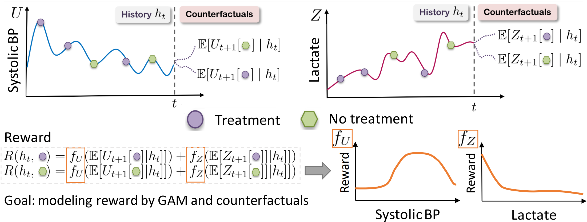

# Extracting Clinician's Goals by What-if Interpretable Modeling: 

This repository is the official implementation of [Extracting Clinician's Goals by What-if Interpretable Modeling](https://arxiv.org/abs/2110.15165). 



## Requirements

To install requirements:

```setup
pip install -r requirements.txt
```

## General Pointers

- See `notebooks/Analyze the best reward from NODEGAM and Linear-cleanup.ipynb` to generate the graphs in the paper.
- See `notebooks/read results-cleanup.ipynb` for the model's performance and the results of the random search.
- See record.sh for all the commands I used.
- The NODE-GAM package is better documented [here](https://github.com/zzzace2000/nodegam).

## Training

### Sepsis Simulations

1. Generate the sepsis expert data. 
```bash
python sepsis_expert_gen.py --gamma 0.9
```
It generates the expert batch data under `data/sepsisSimData/`.

2. Run the baselines MMA and CIRL:
```bash
# MMA running on GAMMDP with gamma=0.9
mdp='gam'
gamma='0.9'
python -u run_mma.py --name 1002_${mdp}mdp_g${gamma} --mdp ${mdp} --gamma ${gamma} --disc_state_type current
# CIRL on GAMMDP
python -u run_mma.py --name 1002_${mdp}mdp_g${gamma} --mdp ${mdp} --gamma ${gamma} --disc_state_type next
```

3. Run the CAIRL on simulations.
```bash
gamma='0.9'
disc_state_time='next'
python -u main.py --name 1013_lmdp_fcnn_s${disc_state_time}_g${gamma} --random_search 25 --epochs 100 --patience 50 --mdp linear --arch AIRL_FCNN_Lightning --disc_state_time ${disc_state_time} --gamma ${gamma}
python -u main.py --name 1013_gammdp_fcnn_s${disc_state_time}_g${gamma} --random_search 25 --epochs 100 --patience 50 --mdp gam --arch AIRL_FCNN_Lightning --disc_state_time ${disc_state_time} --gamma ${gamma}
python -u main.py --name 1013_lmdp_s${disc_state_time}_linear_g${gamma} --random_search 20 --epochs 100 --patience 50  --mdp linear --arch AIRLLightning --disc_state_time ${disc_state_time} --gamma ${gamma}
python -u main.py --name 1013_lmdp_s${disc_state_time}_gam_g${gamma} --random_search 25 --epochs 100 --patience 50 --mdp linear --arch AIRL_NODEGAM_Lightning --disc_state_time ${disc_state_time} --gamma ${gamma}
python -u main.py --name 1013_gammdp_s${disc_state_time}_gam_g${gamma} --random_search 25 --epochs 100 --patience 50 --mdp gam --arch AIRL_NODEGAM_Lightning --disc_state_time ${disc_state_time} --gamma ${gamma}
```

### MIMIC3


1. MIMIC3 data preprocessing

Please see `mimic_preproc/extract-scripts/data clean.ipynb` for details.
We sincerely thank the release of the preprocessing script from [POPCORN paper](https://github.com/dtak/POPCORN-POMDP).
Also, feel free to shot me an email with your MIMIC3 certificates and I am happy to share the preprocessed files with you.

Put all the MIMIC3 files under the data/model-data2/.


2. Train a behavior cloning model using GRU that predicts the expert actions by GRU
```bash
python -u main.py --name 0909_bc --random_search 50 --epochs 200 --patience 50 --arch BC_MIMIC3_Lightning
```
Then look at the results/BC_MIMIC3_Lightning_results.csv to find out which model performs the best. In my experiments, 
`0909_bc_s55_lr0.001_wd1e-05_bs128_nh64_nl1_dr0.0_fnh256_fnl4_fdr0.5` performs the best.

3. Then follow the notebooks/Generate behavior cloning probability.ipynb to generate `bc_prob.pkl` in the data.

4. Then train a counterfactual transition model using GRU
```bash
python -u main.py --name 0921_gru_l1_iptw --random_search 50 --epochs 200 --patience 50 --arch HypotensionGRULightning --obj l1 --iptw 1
```
Then read the file `results/HypotensionGRULightning_results.csv` and picks the best model that has smallest l1 error. For example, `0921_gru_l1_iptw_s48_lr0.0005_wd0.0_bs256_nh64_nl1_dr0.0_fnh384_fnl2_fdr0.15_anh64_anl2_ano64_adr0.3` performs the best.

5. Finally, we train our MIMIC3 models based on this counterfactual transition model.
```bash
ts_model_name='0921_gru_l1_iptw_s48_lr0.0005_wd0.0_bs256_nh64_nl1_dr0.0_fnh384_fnl2_fdr0.15_anh64_anl2_ano64_adr0.3'
python -u main.py --name 1008_mimic3_linear --notsave_epochs 10 --random_search 30 --epochs 100 --patience 50 --arch AIRL_MIMIC3_Lightning --ts_model_name ${ts_model_name}
python -u main.py --name 1008_mimic3_gam --notsave_epochs 10 --random_search 30 --epochs 100 --patience 50 --arch AIRL_MIMIC3_NODEGAM_Lightning --ts_model_name ${ts_model_name}
```
Find out the best linear model in `results/AIRL_MIMIC3_Lightning_results.csv` and the best GAM model in `results/AIRL_MIMIC3_NODEGAM_Lightning.csv`.

6. After finding out the best model, run 5 different folds to create error bar for GAM models in the plot. First, we run the best GAM model for 5 times:
```bash
d='1008_mimic3_gam_dlr0.0008_aob1_ls0.005_aGAM_nl3_nt200_ad0_td4_ld0.5_cs0.5_an3000_la0_ll1_od0.1_fnl3_fdr0.5_glr0.0008_bca0.5_s190_dn0.1_dns0.8'
postfix=${d:11}
echo ${postfix}
for fold in '0' '1' '2' '3' '4'; do
  ./my_sbatch python -u main.py --name 1017_mimic3_best_f${fold}_${postfix} --fold ${fold} --load_from_hparams ${d}
done
```
And the best linear model for 5 different folds:
```bash
d='1008_mimic3_linear_dlr0.001_aob0_ls0.005_fnl3_fdr0.5_glr0.0008_bca0.5_s192_dn0.0_dns0.8'
postfix=${d:11}
echo ${postfix}
for fold in '0' '1' '2' '3' '4'; do
  ./my_sbatch python -u main.py --name 1016_mimic3_best_f${fold}_${postfix} --fold ${fold} --load_from_hparams ${d}
done
```

7. Finally, visualize the models by following `notebooks/Analyze the best reward from NODEGAM and Linear-cleanup.ipynb`. See the section 4 MIMIC3 plotting for details.

## Contributing

All content in this repository is licensed under the MIT license.
